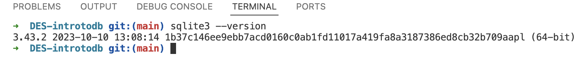

# Basic Data Storage and Management 

## Project Overview

This project demonstrates basic operations with SQLite using the University Rankings dataset (2012–2015). The main objectives are:

1. Explore and understand the dataset.  
2. Perform CRUD (Create, Read, Update, Delete) operations.  
3. Document all steps and results.  

The project uses both SQL and Python for database interaction and printing outputs, providing a clear and reproducible workflow.

---
## Table of Contents

* [Dataset](#dataset)
* [CLI](#SQLite-Setup-and-Verification)
* [Use of two different methods to perform operations](#Why-Python-Was-Used-Along-With-SQL-Environment)
* [Functions and Operations](#Functions-and-Operations-in-the-Script)
* [Summary of Operations](#Summary-of-Operations-Performed)
* [Requirements to run the code](#How-to-Run)
* [Results](#Results-and-Outputs)

## Dataset

The dataset contains global university ranking data from 2012 to 2015. Here is the link for the dataset- https://drive.google.com/file/d/1hEXaWbL4XKRp-NvVjqRUCfPfA-Zs_Qug/view

## SQLite Setup and Verification

Before running queries, the environment was set up and verified:

1. **Checked SQLite installation** to ensure the system can run database queries:

```bash
sqlite3 --version
```



2. Verified database connection in Python to confirm the database file is accessible and ready for queries.

```python
import sqlite3
conn = sqlite3.connect("university_database.db")
cursor = conn.cursor()
```

---

## Why Python Was Used Along With SQL Environment

Python was chosen because:

- It allows programmatic execution of multiple SQL queries.  
- Printing results is simple and clear, making it easy to document changes.  
- Sequential CRUD operations can be executed and verified immediately.  
- It provides a reproducible workflow for future modifications.  

---
### Functions and Operations in the Script

1. **Database Connection** – Connects to the SQLite database.  
2. **Check Table Schema** – Lists all columns and their data types in the university rankings table.  
3. **Preview Data** – Displays the first 15 rows of the dataset.  
4. **Data Summary** – Shows available years, total number of universities, and minimum, maximum, and average scores.  
5. **Top Universities by Score (2014)** – Lists the top 5 universities of 2014 by score.  
6. **INSERT Operation** – Adds a new university record, "Duke Tech" for 2014.  
7. **SELECT Operation** – Counts Japanese universities in the global top 200 for 2013.  
8. **UPDATE Operation** – Increases University of Oxford’s 2014 score by 1.2.  
9. **DELETE Operation** – Removes universities from 2015 with scores below 45.  
10. **Verification / Inspection** – Checks sample rows after performing CRUD operations.  
11. **Commit and Close Connection** – Saves all changes and closes the database connection.

---

## Summary of Operations Performed

| Operation  | Description                                               |
|------------|-----------------------------------------------------------|
| INSERT     | Added Duke Tech (2014, USA, world_rank 350, score 60.5) |
| SELECT     | Counted Japanese universities in top 200 (2013)          |
| UPDATE     | Increased University of Oxford 2014 score by 1.2         |
| DELETE     | Removed 2015 universities with score < 45                |
| DATA ANALYSIS | Previewed first 15 rows, summary statistics, top universities by score |

---
## How to Run

1. Ensure SQLite is installed and check its version.  
2. Place `university_database.db', `script.py` and 'script.sql' in the same folder.  
3. Run the Python script from the terminal.  
4. Run the SQL script using SQLite -
Open terminal and navigate to the folder containing university_database.db and the script, Execute the SQL file:
```sql
    sqlite3 university_database.db < script.sql 
```
SELECT queries will display outputs in the terminal for verification.

5. Observe the outputs for dataset preview, summary statistics, and verification of insert, update, and delete operations.

## Results and Outputs

Outputs for SQL queries-


Outputs for SQL queries run in Python environment-


## Notes
- SQL statements were executed directly in the SQLite CLI.  
- All operations were also executed using Python's sqlite3 module to automate query execution and output verification.  

